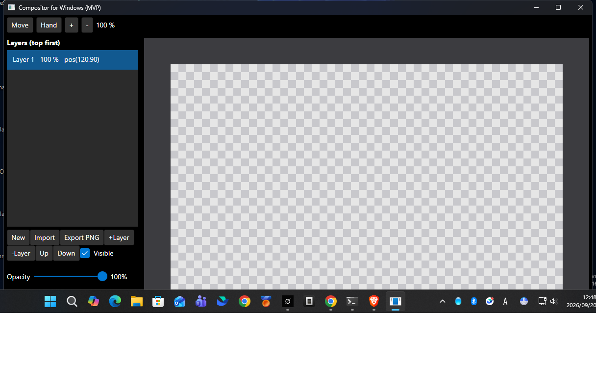

# Compositor for Windows（移植版）

Mac版 Compositor（Wonder Assembly LLC・MIT）のWindows移植版。
C# / .NET 8 LTS + Avalonia UI 11 + SkiaSharp。Document層は非破壊レイヤー構成。



## 要件
- OS: Windows 10 1809以降 / Windows 11 (x64)。
- ランタイム不要 (.NET 8自己完結・`Compositor.exe` 単体起動)。
- 開発: .NET 8 SDK (WSL可、`EnableWindowsTargeting` でwin-x64向けビルド)。

## 導入
1. 配布zip (`Compositor-Windows-<version>-win-x64.zip`) を任意フォルダに展開。
2. `Compositor.exe` を起動 (インストール作業・管理者権限不要)。
3. 同梱の `LICENSE.txt` / `README.md` でライセンス・使い方を確認。
4. 既定の導入先: `C:\Users\<user>\Apps\Compositor.Windows\` (MVP配置 `...\Apps\Compositor\` とは別フォルダで共存可)。

```powershell
# リリースzip作成 (Windows側)
powershell -ExecutionPolicy Bypass -File tools\Make-Release.ps1 -Version v1.0.0-windows
```

## 使い方 (概要)
- 上=ツールバー (Undo/Redo・Copy/Paste・Move/Hand・ズーム)、左=レイヤーパネル、右=キャンバス。
- `New`→`Import` (PNG/JPG/BMP) でレイヤー追加→ドラッグで非破壊移動→`Export PNG` で書出し。
- 詳しくは [5分チュートリアル](docs/TUTORIAL.md)。操作画面は [スクリーンショット](docs/screenshots/README.md)。
- ショートカット: V=Move H=Hand Ctrl+Z/Y=Undo/Redo Ctrl+C/V=Copy/Paste Ctrl+N/O/E Del。

## 上流ライセンス継承
- 上流: Mac版 Compositor（MIT License, Copyright (c) 2026 Wonder Assembly LLC）
- 本リポジトリの LICENSE は上流MITをそのまま継承 (改変なし)。
- 配布zipには `LICENSE.txt` として同梱。アプリ内 About での表示は未実装 (残課題)。
- 命名・構成はMac版と区別するため `Compositor for Windows` / `Compositor.Windows` とする (詳細は [命名・構成](docs/NAMING.md))。

## 動作確認済み（実機E2E）
- 起動・レイヤー追加/削除/並べ替え・非破壊移動（ドラッグ）・合成表示・PNG書出し
- E2E S1/S2/S4合格・S3合成表示合格（t_48a8bb54）。クラッシュ2件は t_3b5fced0 で修正済み。
- クリップボード Copy/Paste（アプリ内PNG経由）・Undo/Redo・ブレンド16種・Photoshop流ショートカットは本ブラッシュアップで実装。

## 未対応の明示
- `Subject Removal (未対応)` ボタンは無効化＋ツールチップで明示（Mac版の機能。Windows版では未対応）。
- その他の未移植機能の一覧は FEATURE_GAP.md を参照。

## ビルド（WSLからWindows向け）
```
export DOTNET_ROOT=$HOME/.dotnet PATH=$HOME/.dotnet:$PATH
dotnet test tests/Compositor.Tests/Compositor.Tests.csproj
dotnet publish src/Compositor.Avalonia -c Release -r win-x64 --self-contained true -o src/publish-win
```
配置: `src/publish-win/` → `C:\Users\sunao\Apps\Compositor\`（上書き前に taskkill /IM Compositor.exe /F）

## テスト
- 単体8件＋性能2件＝10件合格（`dotnet test`）。
- 性能実測（WSL, 2026-09-20）: 4K 3レイヤー合成 94ms／1000回合成ストレス 965ms・メモリ +373KB（リークなし目安50MB未満）。
- ショートカット: V=Move H=Hand Ctrl+Z/Y=Undo/Redo Ctrl+C/V=Copy/Paste Ctrl+N/O/E Del。

## 配布
- `tools/Make-Release.ps1` で `src/publish-win` 自己完結出力を LICENSE.txt/README.md 同梱でzip化＋SHA256発行 (`dist/`)。
- MSIXは `packaging/Package.appxmanifest` 草案まで (コード署名は有効な証明書が必要なため未実施・保留)。
- クリーン導入→起動→基本操作の証跡は [docs/INSTALL_VERIFY.md](docs/INSTALL_VERIFY.md)。
- 公開リリース手順・証跡はタスクカード t_a33fadbd のコメント参照。
